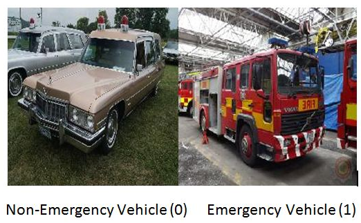

# Emergency and Non Emergency Vehicle Classification

This python notebook is done as a part of [JanataHack ComputerVision Hackathon](https://datahack.analyticsvidhya.com/contest/janatahack-computer-vision-hackathon/)
conducted by Analytics Vidhya. The dataset consists of a set of images of vehicles. The problem is to design a machine learning model that 
could correctly classify the images into **Emergency** (for example: ambulance, fire truck) and **Non Emergency Vehicles** 
(Eg: Passenger Car, SUV etc.). Accuracy is taken as the performance metric.
I used two approaches: a **normal CNN** and **transfer learning**.

In the first approach, I trained a normal CNN with 4 convolution + maxpooling layers and 2 dense fully connected 
layers and managed to get into 83% accuracy even with fine tuning. I think, the normal CNN like the one I have used has its own limitations, 
since the problem  is somewhat hard. The model should be able to pick the minute features that could help to distinguish 
between an emergency and non emergency vehicle. Hence, the best approach is to go for transfer learning. 

In transfer learning, I chose VGG 16  as a 'feature extractor'. The already pretrained convoluion layers are kept untouched and removed the 
fully connected dense layers and modified according to our requirements. Since VGG 16 has already seen millions of real life images, It can provide better accurate classifications.
The transfer learning model showed a performance of **93% testing accuracy**.

The reader can test the performance of the model in [Analytics Vidhya website](https://datahack.analyticsvidhya.com/contest/janatahack-computer-vision-hackathon/True/#About). 
I started to participate only after the submission deadline. Hence, it won't be possible to see the score in public leader board. I learned the transfer learning using keras from the blog post
on [Transfer Learning in Keras with Computer Vision Models by Jason Brownlee](https://machinelearningmastery.com/how-to-use-transfer-learning-when-developing-convolutional-neural-network-models/) and the
[Youtube tutorial by Krish Naik](https://www.youtube.com/watch?v=zBOavqh3kWU)
